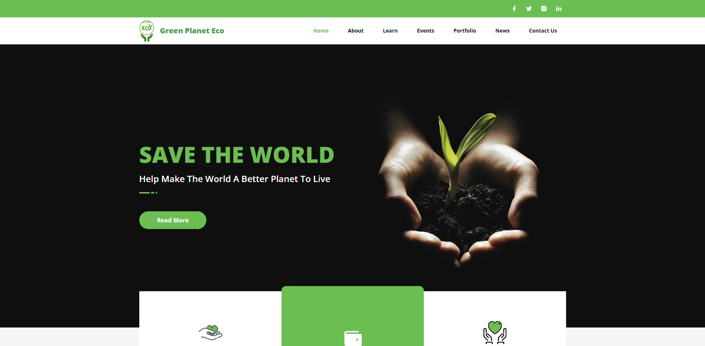

# The smart contract of Green Planet ECO Token

## Live site

## Contact info

- **Email:** atsuokoizumi@gmail.com
- **Telegram:** [@silivex](https://t.me/silivex)
- **Discord** [silivex](https://discordapp.com/users/829485006904754209)

## Release date

Apr 22, 2022

## Last updated at

Apr 22, 2022

## Environment

- `Node.js v18.12.0`

## Stack

- **Framework:** `Hardhat v2.14.0`, `Openzepplin v4.8.3`

## How to run the project.

1. Please open terminal window in the root directory.
2. Please run commands in the following cases.

- To deploy
  `npx hardhat run scripts/run.js --network goerli`

- To verify the smart contract
  `npx hardhat verify [contract address]`
